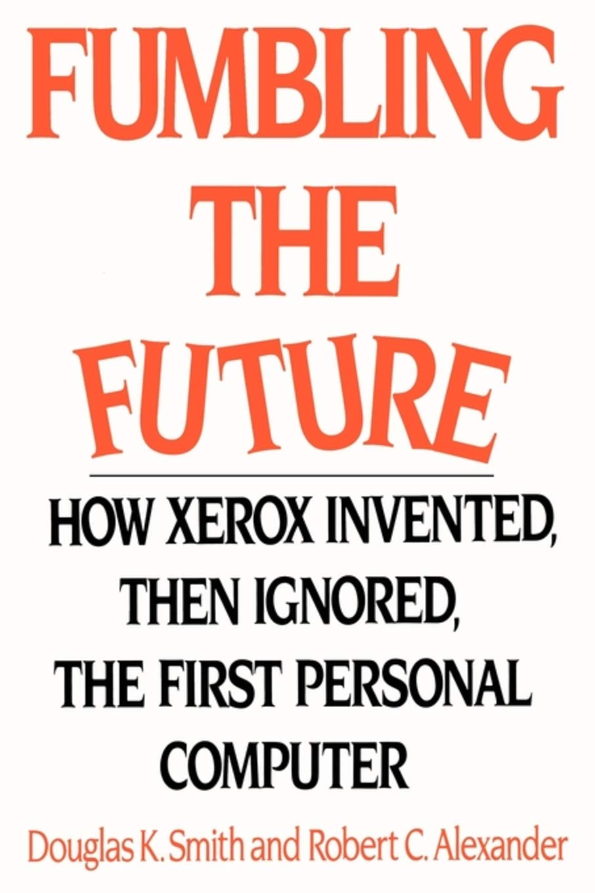

---
# YAML metadata
title: "Fumbling the future"
author: "Matthew Brett"
linkcolor: blue
urlcolor: blue
bibliography:
  - talk.bib
<#ifndef HANDOUT>
suppress-bibliography: true
<#endif>
---

#

# Xerox

* 1938: [Chester
  Carlson](https://en.wikipedia.org/wiki/Chester_Carlson) invents
  *xerography* — the process that will be the basis for
  photocopying.
* 1946: [Joseph
  Wilson](https://en.wikipedia.org/wiki/Joseph_C._Wilson_(entrepreneur)),
  CEO of Xerox, signs development agreement with Carlson.
* 1959: Xerox 914 copier — "the most successful single product of
  all time".
* 1968: [Peter
  McColough](https://en.wikipedia.org/wiki/Charles_Peter_McColough)
  takes over as Xerox CEO.
* 1970: [Xerox Xerox Palo Alto Research
  Center](https://en.wikipedia.org/wiki/PARC_(company))

# [George Pake](https://en.wikipedia.org/wiki/George_Pake)

# [Bob Taylor](https://en.wikipedia.org/wiki/Robert_Taylor_(computer_scientist))

# The team

Just the Turing award winners:

* [Butler Lampson](https://en.wikipedia.org/wiki/Butler_Lampson)
* [Alan Kay](https://en.wikipedia.org/wiki/Alan_Kay)
* [Charles P.
  Thacker](https://en.wikipedia.org/wiki/Charles_P._Thacker)
* [Robert Metcalfe](https://en.wikipedia.org/wiki/Robert_Metcalfe)

# (Some of) what they built

> The office of the future

> ... cheap, powerful personal computers ...

* Desktop, windows icons Graphical User Interface
* Modern word processing
* Ethernet
* Laser printing
* With major contributions to:
    * Programming languages (e.g.
      [Smalltalk](https://en.wikipedia.org/wiki/Smalltalk)
    * [Computer
      graphics](https://en.wikipedia.org/wiki/SuperPaint)
    * ...

# Modern user interface

# Modern word processing

# Snatching defeat from the jaws of victory

* The demos - only the people doing the work saw the value.
* Competing with bean-counters
* 1979: [A visit from
  Apple](https://www.latimes.com/health/la-xpm-2011-oct-05-la-fi-jobs-legacy-hiltzik-20111006-story.html)

# Management unto death

* George Pake tires of Bob Taylor, delegates William J. Spencer to deal with
  the situation.
* Spencer: ["Taylor's not going to leave. He doesn't have anywhere to
  go."](https://asterisk.dynevor.org/fumbling-the-future.html)
* Tells Taylor to toe the line or leave.
* Taylor leaves, team leaves, game over.

> [Spencer said] “Well, you heard him. He’s left, what do you want me to do?”
And someone in the back of the room said, “Quit.” (link above).

# Themes

* Self-satisfaction tends to stasis.
* Listen to the people who are doing the work.
* Hedging bets in a fast-changing market leads to failure.

See: @smith1999fumbling, @hiltzik1999dealers

# The end

Materials at <https://github.com/matthew-brett/lis-talks>.

<#ifdef HANDOUT>
# References
<#endif>
